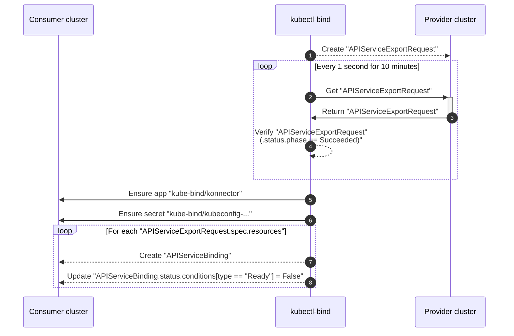

# API Binding

## Overview

```mermaid
sequenceDiagram
    autonumber
    participant consumer-cluster as Consumer cluster
    participant cli as kubectl-bind
    participant provider-cluster as Provider cluster

    %% Create APIServiceExportRequest
    cli-->>provider-cluster: Create "APIServiceExportRequest"

    loop Every 1 second for 10 minutes
    cli->>+provider-cluster: Get "APIServiceExportRequest"
    provider-cluster->>-cli: Return "APIServiceExportRequest"

    cli-->>cli: Verify "APIServiceExportRequest"<br/>(.status.phase == Succeeded)"
    end

    %% Deploy konnector and kubeconfig secret
    cli->>consumer-cluster: Ensure app "kube-bind/konnector"
    cli->>consumer-cluster: Ensure secret "kube-bind/kubeconfig-..."

    loop For each "APIServiceExportRequest.spec.resources"
    cli-->>consumer-cluster: Create "APIServiceBinding"
    cli-->>consumer-cluster: Update "APIServiceBinding.status.conditions[type == "Ready"] = False"
    end
```

