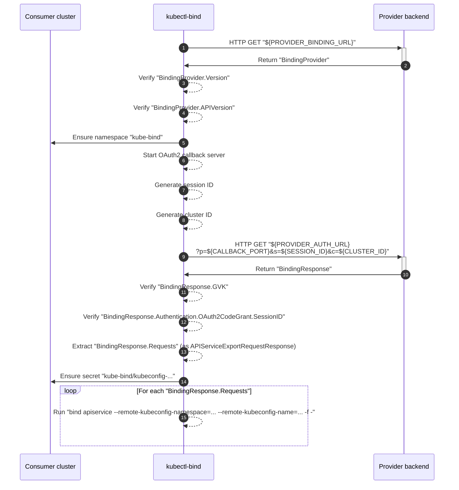

# kubectl bind

```mermaid
sequenceDiagram
    autonumber
    participant consumer-cluster as Consumer cluster
    participant cli as kubectl-bind
    participant provider-backend as Provider backend

    %% Get provider information
    cli->>+provider-backend: HTTP GET "${PROVIDER_BINDING_URL}"
    provider-backend->>-cli: Return "BindingProvider"

    cli-->>cli: Verify "BindingProvider.Version"
    cli-->>cli: Verify "BindingProvider.APIVersion"

    %% Ensure namespace
    cli->>consumer-cluster: Ensure namespace "kube-bind"

    %% Authenticate to provider
    cli-->>cli: Start OAuth2 callback server
    cli-->>cli: Generate session ID
    cli-->>cli: Generate cluster ID

    cli->>+provider-backend: HTTP GET "${PROVIDER_AUTH_URL}<br/>?p=${CALLBACK_PORT}&s=${SESSION_ID}&c=${CLUSTER_ID}"
    provider-backend->>-cli: Return "BindingResponse"

    cli-->>cli: Verify "BindingResponse.GVK"
    cli-->>cli: Verify "BindingResponse.Authentication.OAuth2CodeGrant.SessionID"

    %% Evaluate BindingResponse.Requests
    cli-->>cli: Extract "BindingResponse.Requests" (as APIServiceExportRequestResponse)
    cli->>consumer-cluster: Ensure secret "kube-bind/kubeconfig-..."

    loop For each "BindingResponse.Requests"
    cli-->>cli: Run "bind apiservice --remote-kubeconfig-namespace=... --remote-kubeconfig-name=... -f -"
    end
```
